# Microsoft Azure を無料で始めよう | Azure無料アカウントの試用期間を過ぎたらどうなるのか

# はじめに
先日Azureの無料アカウントを作成しましたが、Webアプリを追加した程度で放置してしまい、**試用期間の30日**を過ぎてしまいました。
無料アカウントを登録後30日経過し試用期間の有効期限が切れると、利用中のサービスは無効になってしまいます。
30日経過後も引き続きサービスを利用したい場合はAzure無料アカウントを従量課金制料金にアップグレードする必要があるのですが、**アップグレードしなかった場合どうなるのか**を確認していきます。

# 1. アップグレードしなかった場合の経過
## (1) 試用期間終了1週間前
試用期間終了1週間前になると、1週間後に試用期間が終了すること、その前にAzureアカウントをアップグレードすれば引き続き無料サービスを含む各種サービスを利用できることをお知らせするメールが届きます。

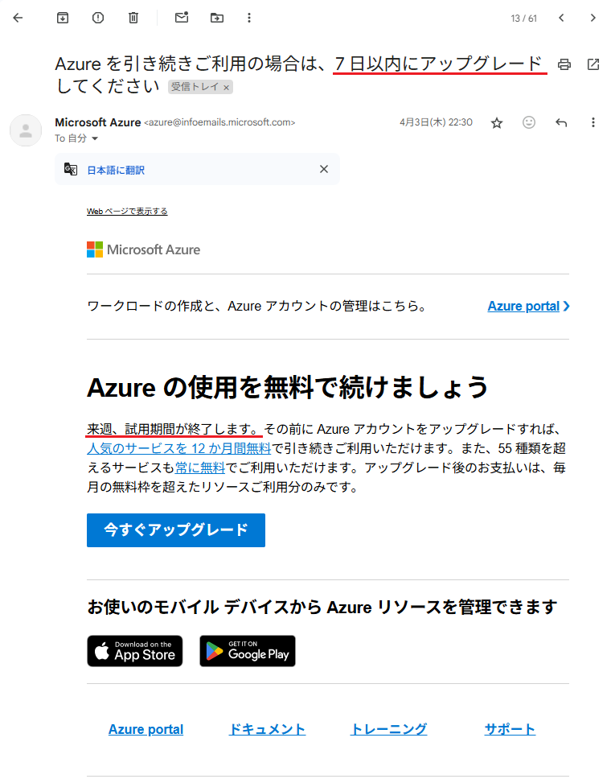

## (2) 試用期間終了3日前
試用期間終了3日前には、試用期間終了1週間前に届いたメールとほぼ同じ内容のメールが再び届きます。

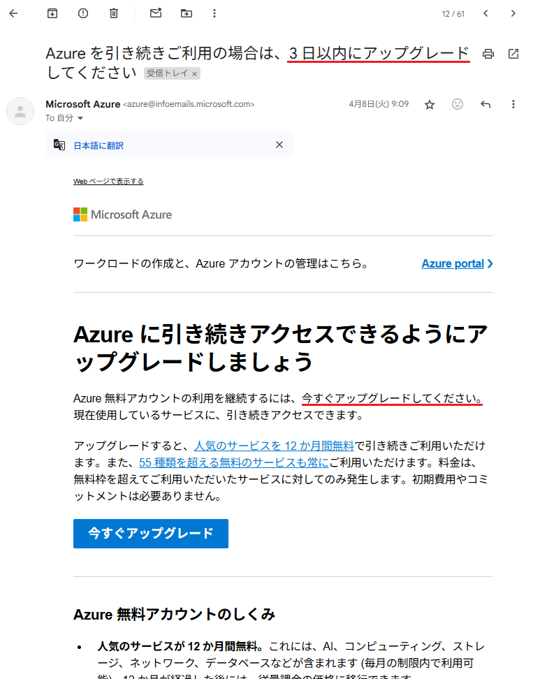

## (3) 試用期間終了当日
試用期間終了当日には、無料クレジットの有効期限が切れたことを知らせるメールが届きます。

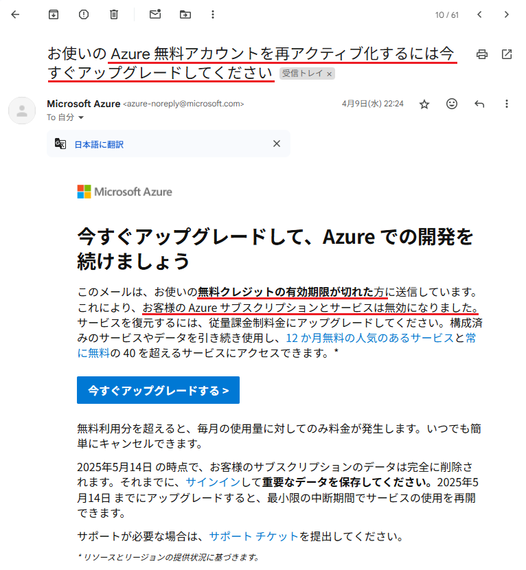

「お客様の Azure サブスクリプションとサービスは無効になりました。サービスを復元するには、従量課金制料金にアップグレードしてください。」と書かれています。
ですが、このタイミングでは**使用中のサービスが完全に削除されるわけではなく、停止されるだけ**のようです。
試用期間が終了したあとにAzurePortalにアクセスしてみると、以下のような画面になります。試用期間中に追加したWebサービスはまだリソースの一覧に表示されています。

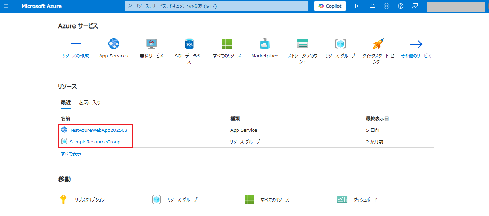

メールには「2025年5月14日 の時点で、お客様のサブスクリプションのデータは完全に削除されます。それまでに、サインインして重要なデータを保存してください。2025年5月14日 までにアップグレードすると、最小限の中断期間でサービスの使用を再開できます。」と書かれています。
それでは5/14を過ぎるとどうなるのでしょうか？

## (4) 試用期間終了から約1か月後
試用期間終了後、数回にわたり「データを保存し Azure での開発を続けるには、20XX年X月XX日 までにアップグレードしてください」という内容のメールが届きます。
それでもアップグレードしないでいると、ついに以下のようなメールが届きます。

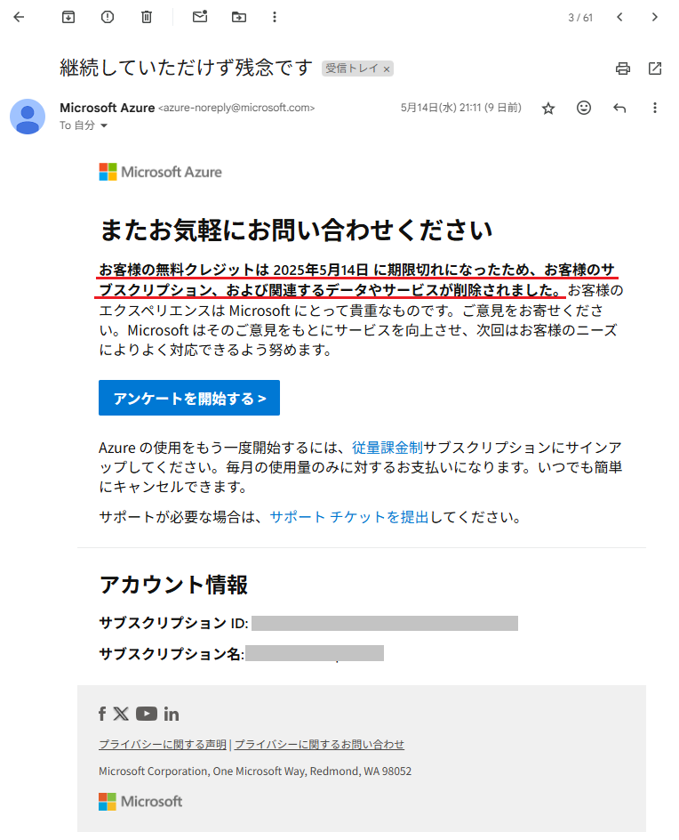

「お客様の無料クレジットは 2025年5月14日 に期限切れになったため、お客様のサブスクリプション、および関連するデータやサービスが削除されました。」と記載されています。
果たしてAzureはどうなっているのか、Azure Portalにログインしてみます。

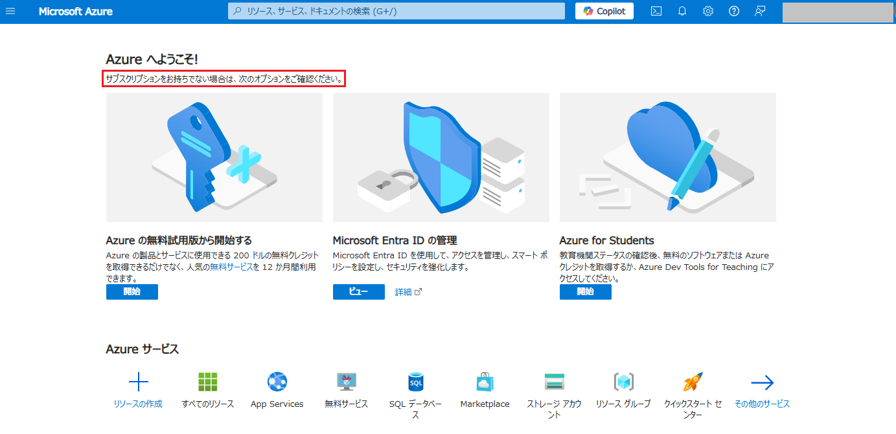

「サブスクリプションをお持ちでない場合は次のオプションをご確認ください」というメッセージが表示されています。
デプロイしていたWebアプリも、跡形もなくなってしまいました。（リソース一覧の画像がなくてすみません・・・）
無料アカウントの試用期間30日を経過した後も、およそ1か月間はアカウントは削除されず、追加したWebアプリなどのリソースも削除はされませんが、**試用期間を経過した後およそ1か月が過ぎるとアカウントが無効になり追加したデータやサービスが削除される**ようです。
少し分かりにくいので、アカウントが無効になるまでの具体的な日付を記載します。

|日付|アカウントの状態|サービスの利用|
|----|----|----|
|3月10日|無料アカウント登録|試用期間開始|
|3月10日～4月9日|試用期間|無料の範囲内で各種サービスを利用可能 USD$200分のクレジットが利用可能|
|4月10日|試用期間終了|データやサービスは利用できないが、削除されていない アカウントをアップグレードすることで利用可能になる USD$200分のクレジットは残額があっても利用不可になる|
|5月14日|アカウント無効化|アカウントが無効化され、データやサービスが削除される|

※試用期間終了からアカウントが無効化されるまでの期間については特に情報がなかったのですが、34日後に無効化されていました。

# 2.無料アカウントをアップグレードする
## (1) アップグレード手順
残念ながら以前追加していたデータやサービスは削除されてしまいましたが、Azure Portalには「Azure の無料試用版から開始する」というメニューが表示されています。
消えたアプリは戻らないとしても、今後もAzureは使用していきたいので「開始」ボタンをクリックしてみます。

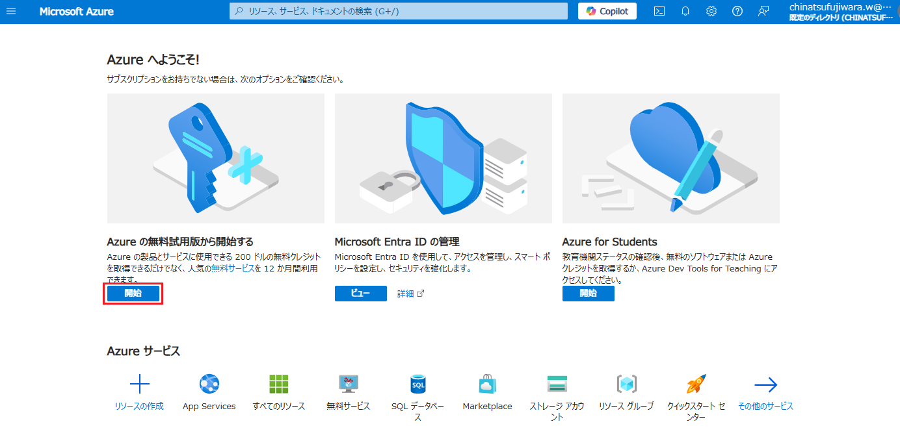

「Try Azure for free」をクリックします。
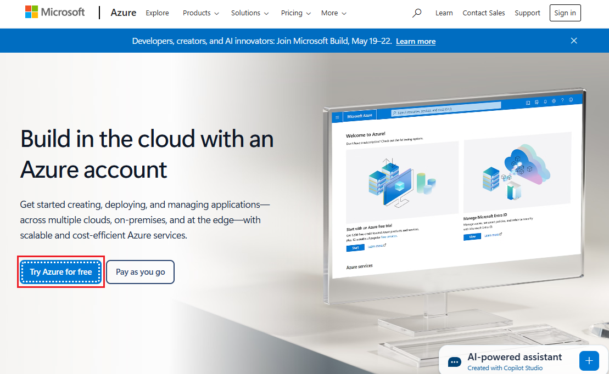

すでに無料アカウント登録済みの場合は、「Pay as you go」を選択しないといけなかったようです。この画面で、「従量課金制 サブスクリプションにサインアップします」のリンクをクリックします。
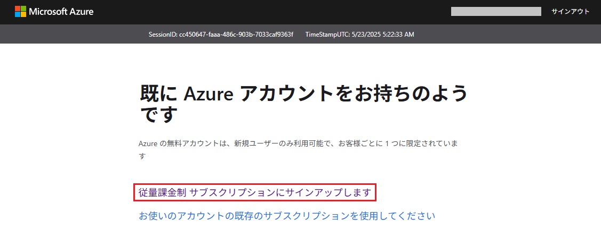

「アカウントのアップグレード」のリンクをクリックします。
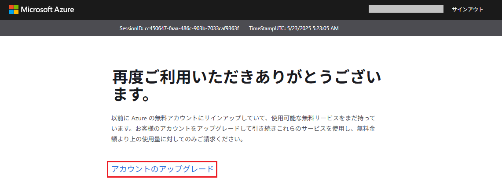

SMS認証のための電話番号を入力し、「自分にテキスト メッセージを送信(SMS 認証)」をクリックします。
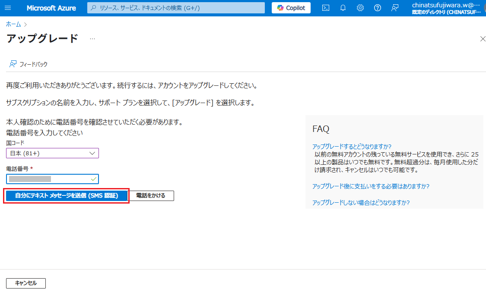

SMSで受診した確認コードを入力し、「コードの確認」をクリックします。
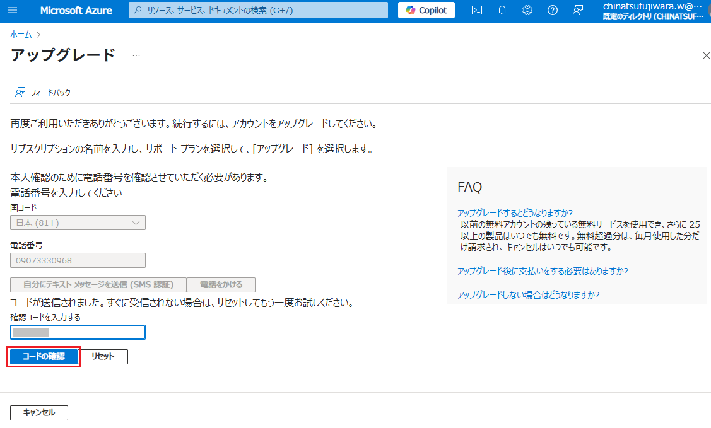

引き続き無料で利用していくため、サポートプランは「Basic」を選択し「従量課金制にアップグレード」をクリックします。
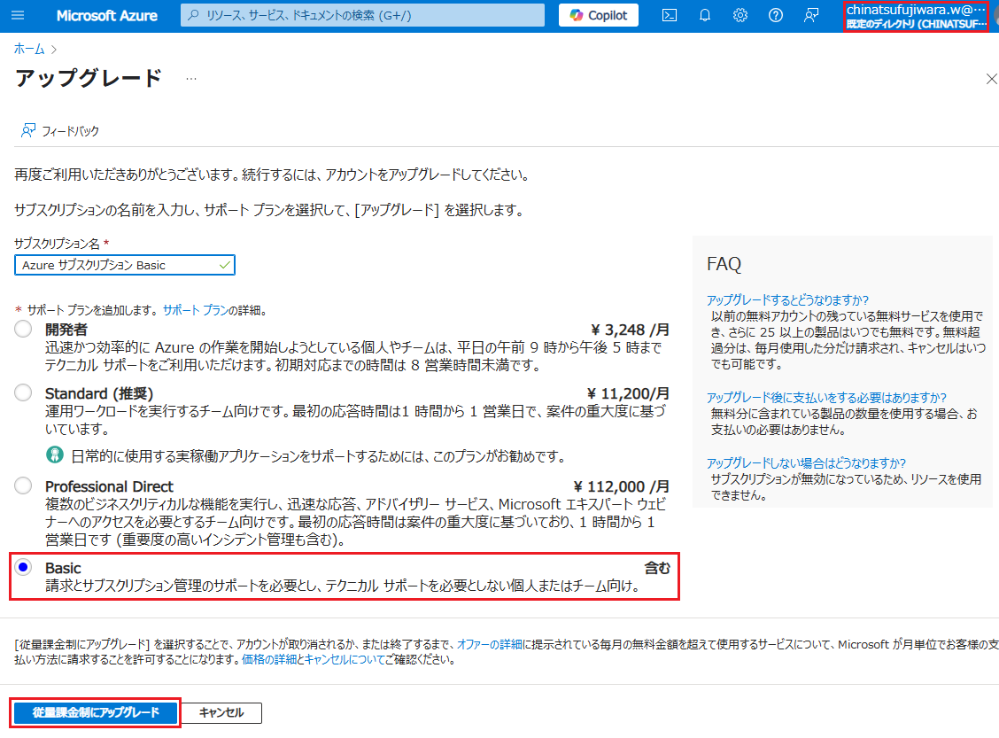

支払方法の確認画面が表示されるので、登録したクレジットカードの認証などを行います。
クレジットカードの認証が終わると、「アップグレードしました。ご自分の Azure コストを把握しましょう」という画面が表示されます。
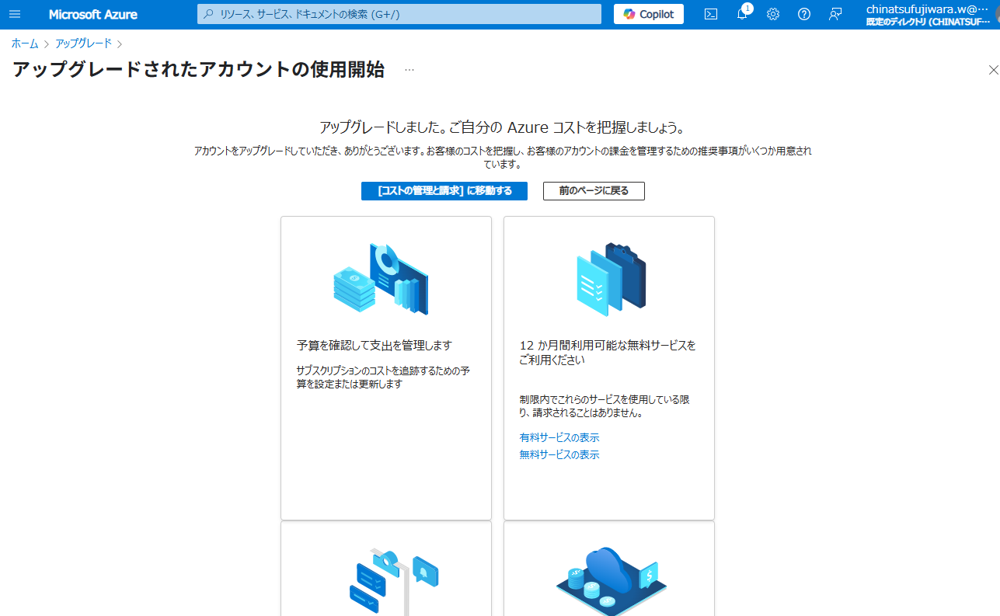

これで無事にアカウントをアップグレードすることができました。
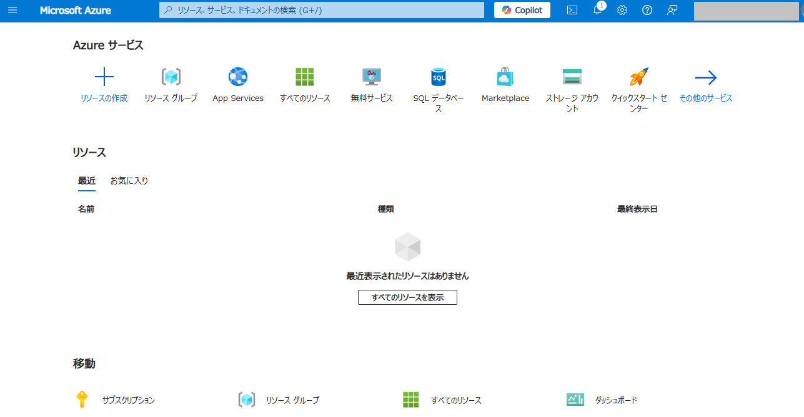

リソースの作成、Webアプリのデプロイも可能になりました。
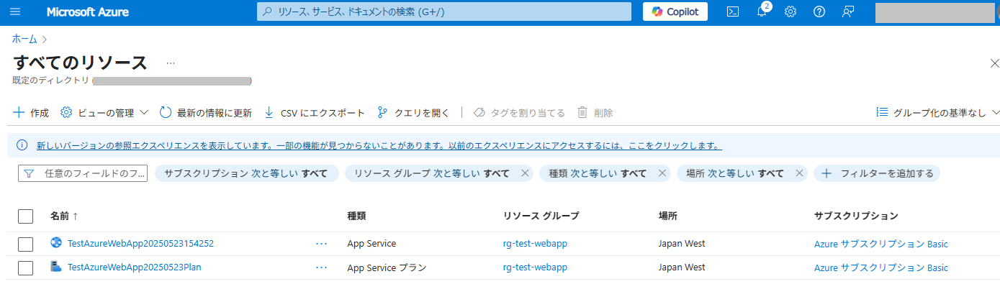

## (2) 無料アカウント アップグレード後の状態を確認
Azure Portalの[コスト管理]ー[支払方法]を確認します。
Azureへの初回登録者は200ドル分のクレジットが付与されていましたが、こちらも有効期限は30日間だったので当然ながらクレジットの残高は￥0になっています。もったいないですね・・・。

費用については、[コスト管理]ー[請求書]から確認することができます。
現時点での請求額は￥0.00となっていることがわかります。
無料アカウントをアップグレードすることで費用が発生するのでは？という疑問がありますが、アップグレードするだけでは料金は発生しませんでした。
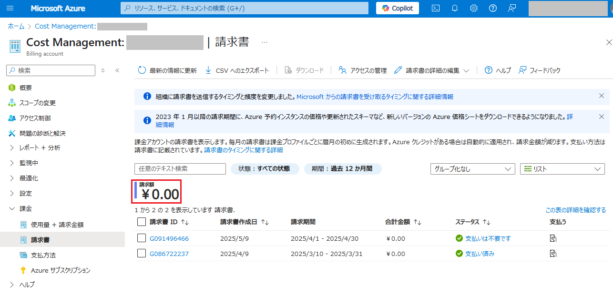

# まとめ
- 無料アカウントの試用期間は30日
- 試用期間の30日を過ぎるとAzureに追加したデータやサービスは使用できなくなるが、削除はされない
- 試用期間が終了したあとさらに約1か月経過すると、アカウントが無効になりデータやサービスが削除される
- 削除されたデータやサービスは、アカウントをアップグレードしても復活しない
  
Azureの無料アカウントを登録しましたが、アップグレードをしないで放置しているとアカウントが無効化され、データやサービスが削除されてしまうことがわかりました。
しかし、削除されるまでには複数回メールでお知らせしてくれますので、気づかないうちに削除されていた、ということはないと思います。

Azureではアカウント登録から12か月間無料で使用できるサービスがあります。
また、特定の範囲内の利用であれば費用がかからないサービスもたくさんありますので、上手に利用してAzureの学習を続けていきたいですね。
