# Microsoft Azure を無料で始めよう | 利用開始手順と無料で利用できるサービスを解説

## はじめに
**Azure**とは、Microsoftが提供するクラウドサービスです。
正式には**Microsoft Azure**と呼ばれ、企業や開発者がインターネット経由でさまざまなITリソースやサービスを利用できるようにするものです。同じようなクラウドサービスとしてAWS（Amazon Web Service）があります。こちらはAmazon社が提供するクラウドサービスです。
Azureを使うことで、物理的なサーバーを購入して運用する必要がなくなり、インターネット越しにリソース（コンピュータ、ストレージ、ネットワーク、データベースなど）を必要なときに必要なだけ利用することができます。そのため、コストを抑えて導入できる、必要に応じて拡張できる（柔軟性の向上）などのメリットがあり、多くの企業で取り入れられています。

Azureは無料で始めることができ、制限はあるものの、多くのサービスを利用することができます。
ここでは、無料でAzureを始める方法および、無料で利用できるサービスについて説明します。

## 1. Azureの無料アカウントを作成する
Azureを始めるため、まずはAzureのアカウントを作成します。
必要なものは以下の3つです。
- MicrosoftアカウントまたはGitHubアカウント
- 電話番号
- クレジットカードまたはデビットカード（プリペイドではないもの）
  

電話番号とクレジットカード（またはデビットカード）は本人確認のために使用されるもので、**無料アカウントを作成しただけでは課金されることはありません**。

### (1) サインアップする
[こちら](https://azure.microsoft.com/ja-jp/pricing/purchase-options/azure-account/)のサイトから無料アカウントを作成します。
今回は無料アカウントを作成するため、ページ左側の「Azure 無料アカウント」のところの「サインアップ」をクリックします。
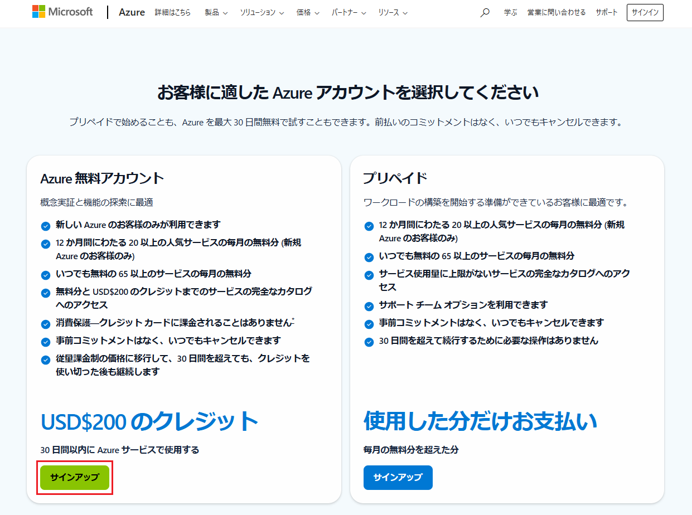
MicrosoftアカウントまたはGitHubアカウントでサインインします。アカウントがない場合は、作成します。

### (2) プロフィールを入力する
プロフィール情報を入力します。入力したら「テキストメッセージを送信する」または「電話する」をクリックします。
ここでは「テキストメッセージを送信する」を選択しました。
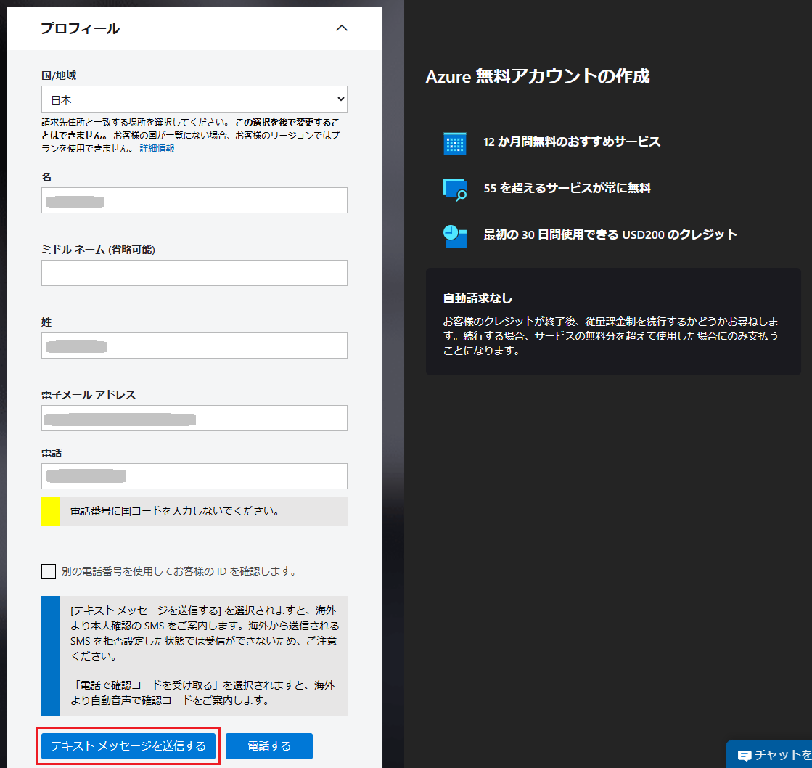

テキストメッセージで送信された確認コードを入力し、「コードの確認」をクリックします。
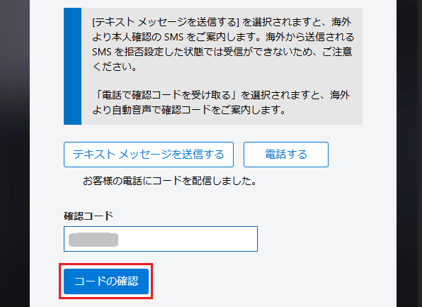

住所など必要事項を入力し「私はこのアカウントで特定された個人であることを表明します。」という箇所にチェックを入れ、「次へ」をクリックします。
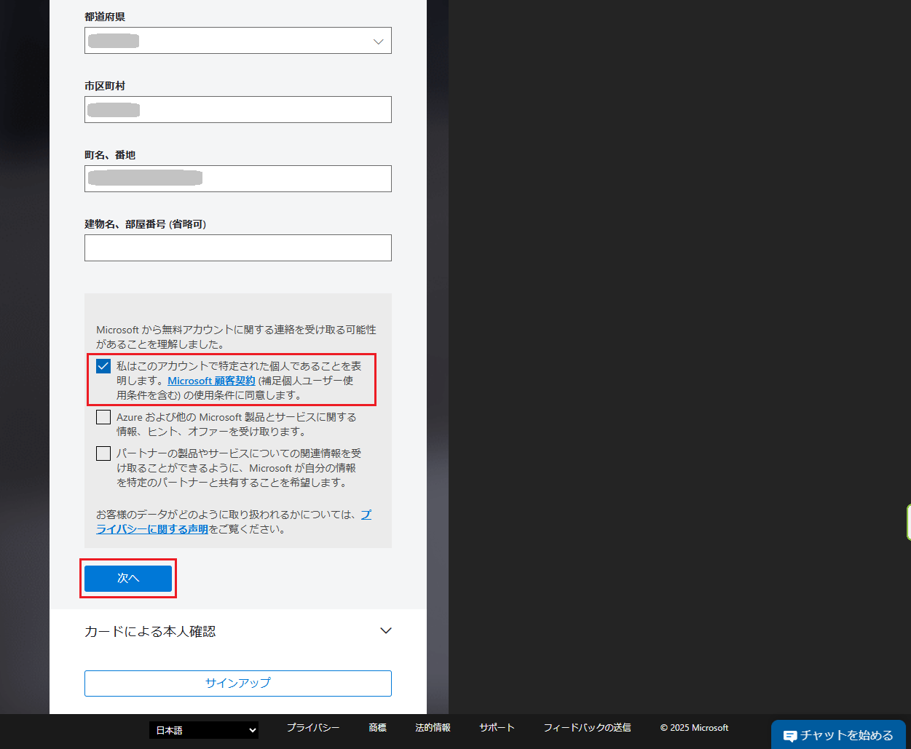

### (3) カードによる本人確認
クレジットカードの情報を入力し、「サインアップ」をクリックします。
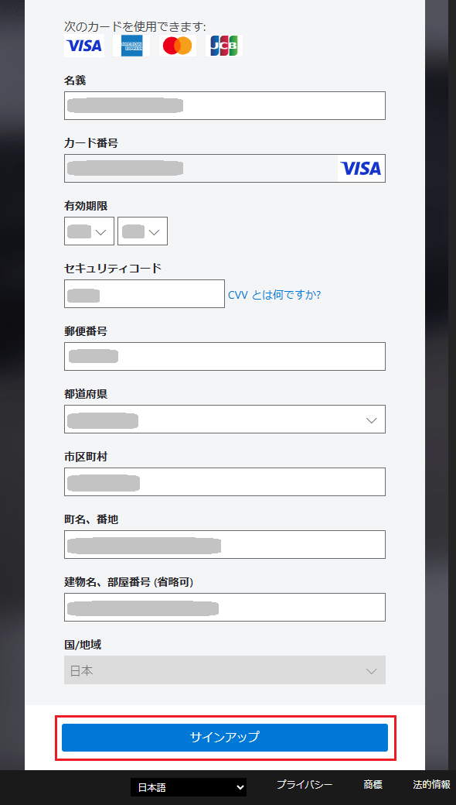

「アカウントの保護」が表示されるので「次へ」をクリックします。
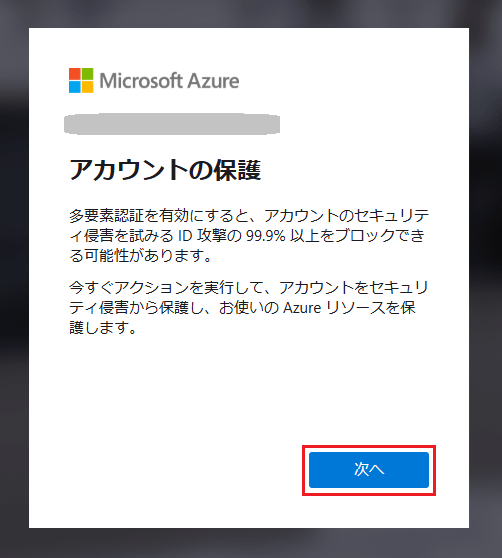

「You're ready to start with Azure」と表示されたら、Azureの準備は完了です。「Go to Azure Portal」をクリックします。
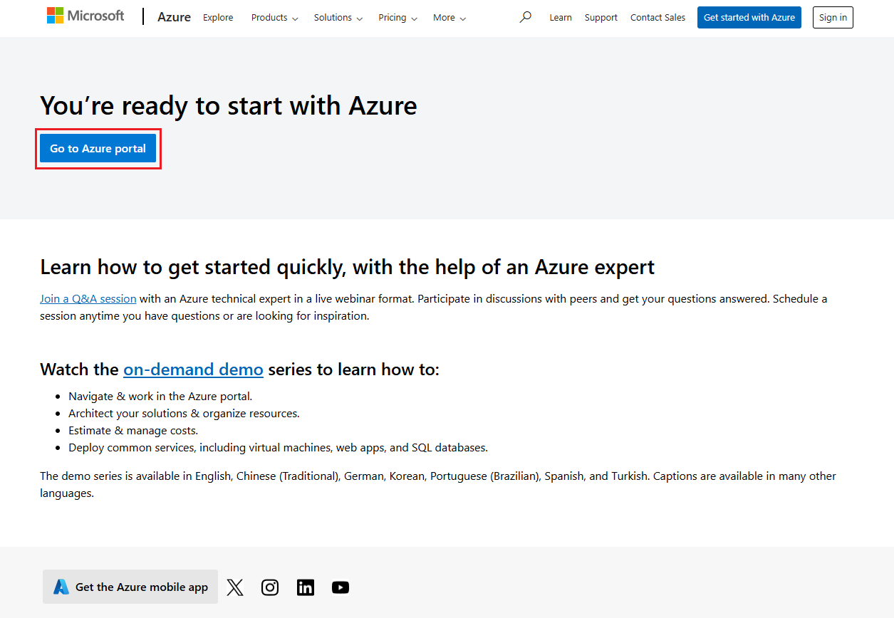

「ホーム」または「Microsoft Azure」をクリックし、Azure Portalサイトのトップページを表します。これでAzureを使用できるようになりました。
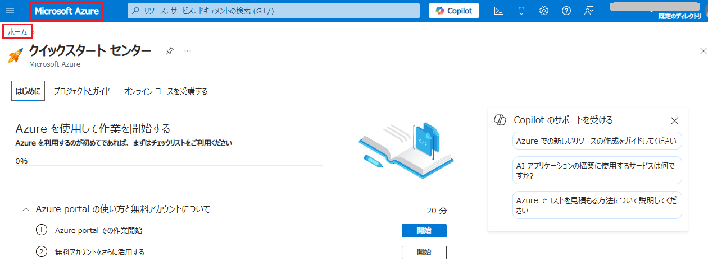

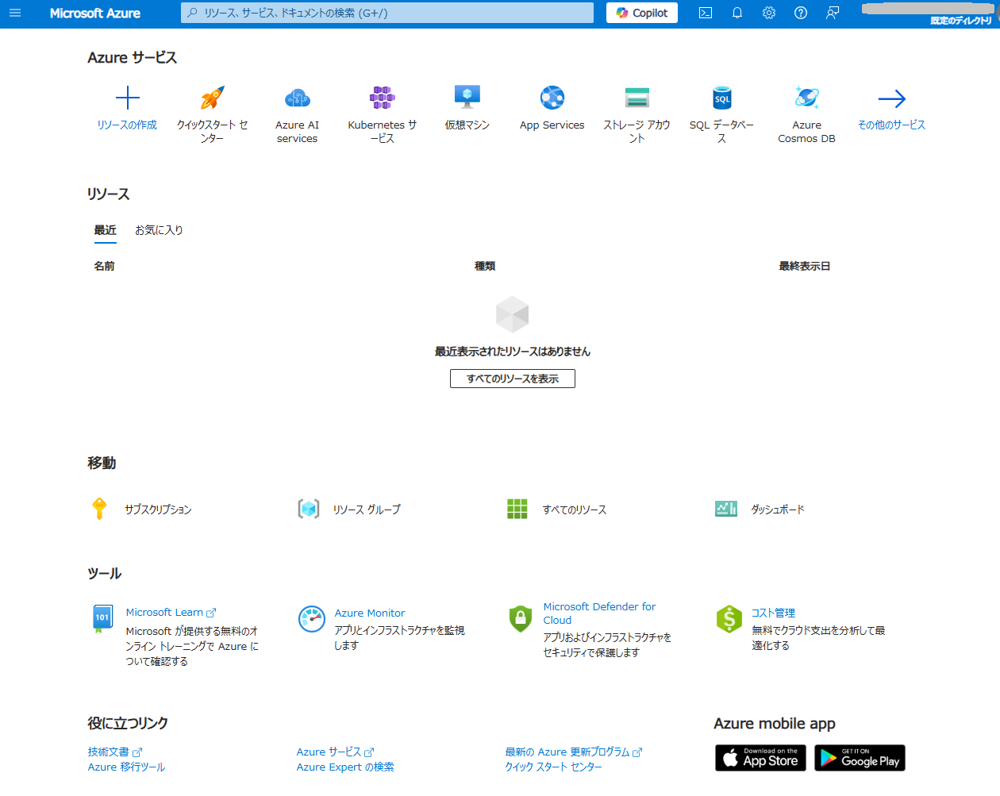

## 3. Azure 無料アカウントで利用できるサービス
Azureの無料枠には、主に3つの種類があります。
- 常時無料で利用できるもの
- 12か月間無料で提供されるもの
- 登録から30日間で最大200ドル分のクレジット無料枠
  
無料サービスの詳細については、以下のサイトに記載されています。
https://azure.microsoft.com/ja-jp/pricing/purchase-options/azure-account/#free-services

### 常時無料のサービス
Azureサービス|説明|毎月の無料分
-|-|-
App Service|フル マネージド のサービスとしてのプラットフォーム (PaaS) を使用して、Web アプリと API をグローバルに迅速に構築、デプロイ、スケーリングできます。|最大10個のWeb/モバイル/APIアプリ、1GBのストレージ(1日あたり1時間)
Azure Functions|サーバーレスコンピューティングのサービス。サーバー不要のコード アーキテクチャを使用してイベントを処理できます。|100万回の要求
Azure SQL Database|インテリジェンスが組み込まれた SQL Database を作成できます。|100,000 仮想コア秒のサーバーレス層と 32 GB のストレージをそれぞれ備えた最大 10 個のデータベース
Azure DevOps|Gitのリポジトリ、CI/CD、ビルド及びリリースの自動化機能を使用して、あらゆる言語でアプリを作成できます。|5ユーザー(無制限プライベートGitリポジトリ付き)
AI Speech - Text to Speech|テキストをリアルな音声に変換するアプリを構築できます。|50万文字のニューラル文字

### 12か月無料のサービス
Azureサービス|説明|毎月の無料分
-|-|-
Azure Virtual Machines - Windows|Windows VM を作成できます。|B1s、B2pts v2(Armベース)、B2ats v2(AMDベース)のバースト可能VMそれぞれ750時間
Azure Virtual Machines - Linux|Linux Virtual Machines(VM)を作成できます。|B1s、B2pts v2(Armベース)、B2ats v2(AMDベース)のバースト可能VMそれぞれ750時間
Azure Database for MySQL|フル マネージドでスケーラブルな MySQL Database を Azure でホストできます。|フレキシブル サーバー 750 時間 - バースト可能 B1MS インスタンス、32 GB のストレージ、32 GB のバックアップ ストレージ
Azure Database for PostgreSQL|フル マネージドの PostgreSQL 向けデータベースを使用して、インテリジェントでスケーラブルなアプリを構築できます。|フレキシブル サーバー 750 時間 - バースト可能 B1MS インスタンス、32 GB のストレージ、32 GB のバックアップ ストレージ
Azure Blob Storage|高度にスケーラブルなオブジェクトストレージを使用して、あらゆる種類の非構造化データに対応できます。|5GBのローカル冗長ストレージ(LRS)ホットブロック、20,000件の読み取りおよび10,000件の書き込み操作
AI Document Intelligence|ドキュメントからのテキスト、キー/値のペア、テーブルの抽出を自動化できます。|500 ページ S0 レベル

### 登録から30日間で最大200ドル分のクレジット無料枠
無料ではないサービスを使ってみたい場合、登録から30日以内であれば200ドルのクレジットを利用することができます。
例えばVirtual Machineを作成した場合、750時間/月を超えて使用する場合は料金が発生することになりますが、この料金に200ドルのクレジットを使用するということができるようです。

## 3. Azure無料アカウントの試用期間
Azure無料アカウントの試用期間は **30日間**です。
12か月無料のサービスなどがあるため、試用期間が12か月なのかと勘違いしがちなので注意が必要です。
無料アカウントを登録後30日経過し試用期間の有効期限が切れると、**利用中のサービスは無効になってしまいます**。
30日経過後も引き続きサービスを利用したい場合は、**Azure無料アカウントを従量課金制料金にアップグレードする**必要があります。
アップグレード後も無料の範囲内でサービスを利用する分には料金は発生しません。
課金を避ける方法、無料アカウントをアップグレードする方法については以下のサイトが参考になります。

[Azure無料アカウントでの課金を避ける](https://learn.microsoft.com/ja-jp/azure/cost-management-billing/manage/avoid-charges-free-account)

[Azure無料アカウントまたはAzure for Students Starterアカウントをアップグレードする](https://learn.microsoft.com/ja-jp/azure/cost-management-billing/manage/upgrade-azure-subscription)

## 4. まとめ
このように、Misrosoftアカウント(またはGitHubアカウント)、電話番号、クレジットカードがあれば無料で簡単にAzureを始められることがわかりました。
また、Azure Portalでは無料のサービスを確認することができます。
Azure Portalにサインインし、検索欄に「**無料サービス**」と入力すると表示される「無料サービス」を選択すると、**Azureが提供する無料枠のサービス一覧**が表示されますので、こちらで確認ができます。
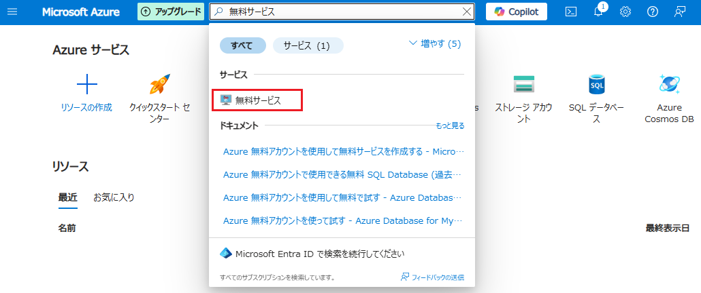

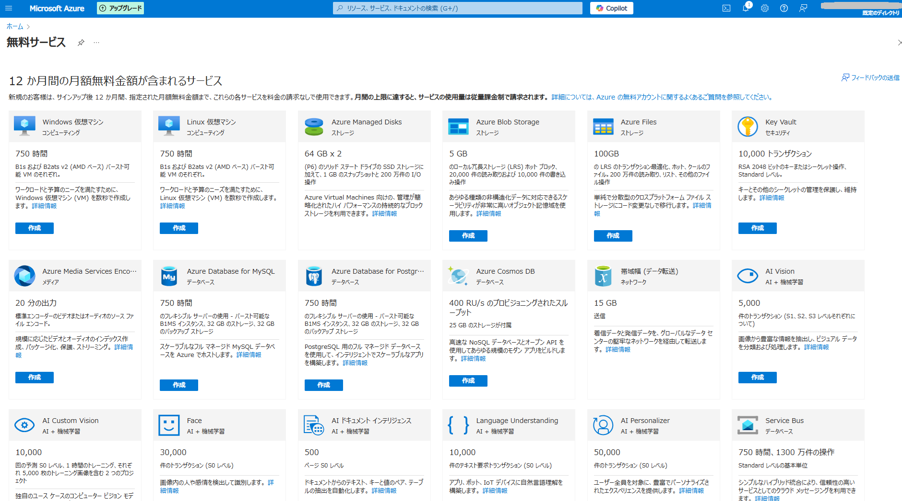

課金を避けるためには、
- サービスを利用する際には無料サービスページからリソースを作成する
- リソースを作成する際は、無料のレベルを選択する
- 12か月無料のサービスを利用している場合は、12か月が過ぎる前にリソースを削除する
  
という点に気を付ける必要があります。

制限はあるものの、無料でもかなりの種類のサービスを利用することができます。
実運用の前にまずはAzureを使ってみたい、どんなことができるのか知りたい、という場合にはまずは**無料アカウントを作成する**、というのはおすすめです！

